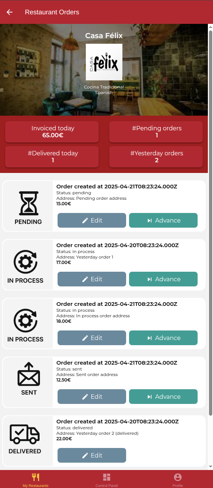
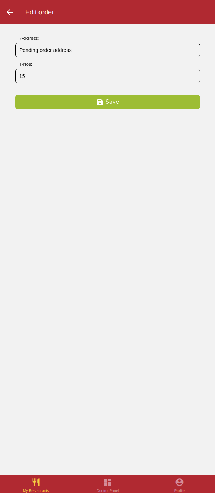

# Examen DeliverUS - Modelo A - Pedidos (Orders)

Recuerde que DeliverUS está descrito en: <https://github.com/IISSI2-IS-2025>

## Enunciado del examen

Se ha de implementar la interfaz gráfica de algunos requisitos funcionales de los propietarios, en concreto:

### RF.01 – Visualización de pedidos por restaurante

**Como**  
propietario,

**Quiero**  
ver un listado con todos los pedidos realizados a uno de mis restaurantes. Para cada pedido, necesito conocer su fecha de creación, el estado, la dirección de entrega y el precio,

**Para**  
poder hacer un seguimiento y gestión de los mismos.

---

### RF.02 – Edición de algunas propiedades de pedidos

**Como**  
propietario,

**Quiero**  
poder editar la dirección de entrega y el precio de los pedidos realizados a mis restaurantes,

**Para**  
corregir errores o actualizar información relevante.

### Pruebas de aceptación

- El propietario puede acceder a la edición de un pedido desde el listado de pedidos de su restaurante.
- Solo se muestran los campos dirección de entrega y precio total y han de presentarse con los valores actuales del pedido que se desea editar.
- Ambos campos (dirección de entrega y precio total) son obligatorios.
- Si se intenta guardar un pedido sin completar la dirección de entrega, se muestra un mensaje de error indicando que el campo es obligatorio.
- Si se intenta guardar un pedido sin establecer el precio total, se muestra un mensaje de error indicando que el campo es obligatorio.
- Si se introduce un precio igual o inferior a 0, se muestra un mensaje de error indicando que el valor debe ser mayor que 0.
- Al guardar correctamente los cambios, se actualiza la información del pedido y se muestra un mensaje de confirmación.
- Tras la correcta actualización de datos, se ha de navegar automáticamente hacia el listado de pedidos que debe presentar la información actualizada.

---

### RF.03 – Visualización de analíticas de pedidos de restaurante

**Como**  
propietario,

**Quiero**  
visualizar analíticas sobre los pedidos de cada uno de mis restaurantes. Para cada restaurante quiero conocer: el importe facturado hoy, el número de pedidos en estado `pending`, el número de pedidos de hoy en estado `delivered` y el número de pedidos realizados ayer.

**Para**  
tomar decisiones informadas sobre la gestión de mi restaurante.

---

### RF.04 – Cambio de estado de un pedido

**Como**  
propietario,

**Quiero**  
poder cambiar el estado actual de los pedidos realizados a mis restaurantes. Desde el estado `pending`, puedo pasarlo a `in process`; de `in process` a `sent`; y de `sent` a `delivered`,

**Para**  
mantener actualizado el estado de mis pedidos y que el cliente esté informado de ello.

### Pruebas de aceptación

- Al cambiar correctamente el estado de un pedido, se ha de reflejar en el listado y se ha de actualizar la sección de analíticas. Además se ha de mostrar un mensaje de éxito.
- Si no se ha podido cambiar el estado se ha de mostrar un mensaje de error.
- Los pedidos en estado ´delivered´ no pueden cambiar de estado ni se debe presentar la opción de cambiarlo.

## Ejercicios

### 1. Listado de pedidos. 3 puntos

Trabaje el RF.01 en el fichero `./DeliverUS-Frontend-Owner/src/screens/orders/OrdersScreen.js` realizando todos los cambios necesarios para mostrar una interfaz como se muestra en la Figura 1.



Figura 1: listado de pedidos y analíticas

Aspectos a tener en cuenta:

- La pantalla de listado de pedidos es accesible desde el botón de `Check orders` que se ha incorporado en la pantalla de detalles de restaurante `RestaurantDetailScreen`
- La imagen que representa el estado del pedido puede obtenerse a través de la función `getOrderImage(status)` que ya se le proporciona en el mismo fichero.
- El listado de pedidos puede obtenerse a través de la función `getRestaurantOrders (restaurantId)` que ya se le proporciona en `./DeliverUS-Frontend-Owner/src/api/RestaurantEndpoints.js` y que realiza la petición necesaria a backend.
- El botón de edición de pedido se realizará en el ejercicio 2.
- La sección de analíticas se realizará en el ejercicio 3.
- El botón de cambio de estado se realizará en el ejercicio 4.

### 2. Edición de pedido. 3 puntos

Trabaje el RF.02 en el fichero `./DeliverUS-Frontend-Owner/src/screens/orders/EditOrderScreen.js` tal y como se muestra en la Figura 2.



Figura 2: Edición de pedido

Aspectos a tener en cuenta:

- Debe incorporar un botón para navegar a la edición de un pedido desde el listado de pedidos en el fichero `./DeliverUS-Frontend-Owner/src/screens/orders/OrdersScreen.js`.
- Debe incorporar lo necesario para habilitar la navegación hacia la pantalla de edición de pedido.

### 3. Analíticas de restaurante. 2 puntos

Trabaje el RF.03 en el fichero `./DeliverUS-Frontend-Owner/src/screens/orders/OrdersScreen.js` realizando todos los cambios necesarios para mostrar la sección de analíticas tal y como se presenta en la Figura 1.

Aspectos a tener en cuenta:

- Se le proporcionan los estilos `analyticsContainer`, `analyticsRow` y `analyticsCell`, para mostrar la sección de analíticas y ha de completar  las propiedades relacionadas con Flex para ajustarlo fielmente al estilo que se le presenta e la Figura 1.
- El objeto de analíticas que devuelve el backend tiene la siguiente estructura (valores de ejemplo):

    ```Javascript
    {
        restaurantId: 1,
        numYesterdayOrders: 2,
        numPendingOrders: 1,
        numDeliveredTodayOrders: 1,
        invoicedToday: 65.0
    }
    ```

### 4. Cambio de estado. 2 puntos

Trabaje el RF.04 en el fichero `./DeliverUS-Frontend-Owner/src/screens/orders/OrdersScreen.js` realizando todos los cambios necesarios para permitir avanzar el estado de cada pedido tal y como se presenta en la Figura 1.

Aspectos a tener en cuenta:

- Se le proporciona la función `nextStatus(order)` en el fichero `./DeliverUS-Frontend-Owner/src/api/OrderEndpoints.js` que realiza la petición a backend para avanzar en el estado.
- El nombre del `MaterialCommunityIcon` del botón `Advance` es `skip-next`

## Procedimiento de entrega

1. Borrar las carpetas **DeliverUS-Backend/node_modules**, **DeliverUS-Frontend-Owner/node_modules** y **DeliverUS-Frontend-Owner/.expo**.
1. Crear un ZIP que incluya todo el proyecto. **Importante: Comprueba que el ZIP no es el mismo que te has descargado e incluye tu solución**
1. Avisa al profesor antes de entregar.
1. Cuando el profesor te dé el visto bueno, puedes subir el ZIP a la plataforma de Enseñanza Virtual. **Es muy importante esperar a que la plataforma te muestre un enlace al ZIP antes de pulsar el botón de enviar**. Se recomienda descargar ese ZIP para comprobar lo que se ha subido. Un vez realizada la comprobación, puedes enviar el examen.

## Preparación del Entorno

### a) Windows

- Abre una terminal y ejecuta el siguiente comando:

    ```bash
    npm run install:all:win
    ```

### b) Linux/MacOS

- Abre una terminal y ejecuta el siguiente comando:

    ```bash
    npm run install:all:bash
    ```

## Ejecución

### Backend

- Para **recrear las migraciones y seeders**, abre una terminal y ejecuta el siguiente comando:

    ```bash
    npm run migrate:backend
    ```

- Para **iniciar el backend**, abre una terminal y ejecuta el siguiente comando:

    ```bash
    npm run start:backend
    ```

### Frontend

- Para **ejecutar la aplicación frontend del `owner`**, abre una nueva terminal y ejecuta el siguiente comando:

    ```bash
    npm run start:frontend
    ```

## Depuración

- Para **depurar el frontend**, asegúrate de que **SÍ** haya una instancia en ejecución del frontend que deseas depurar, y usa las herramientas de depuración del navegador.
